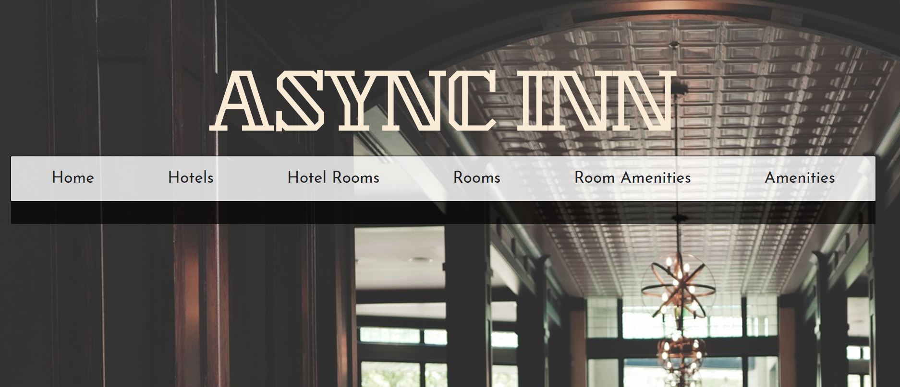
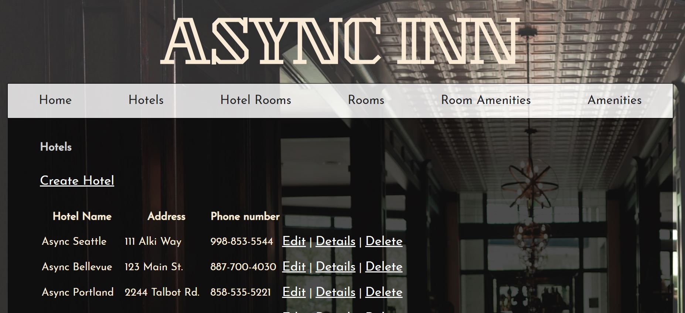
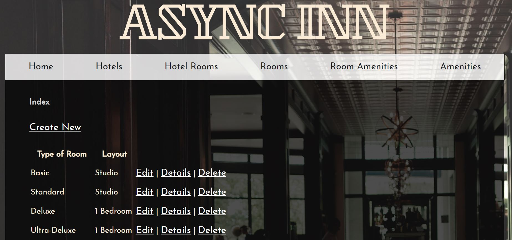
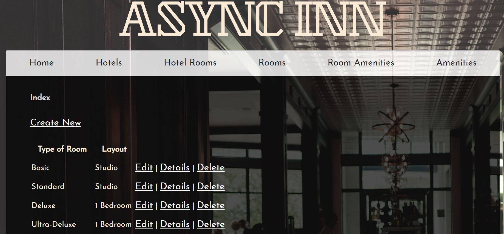
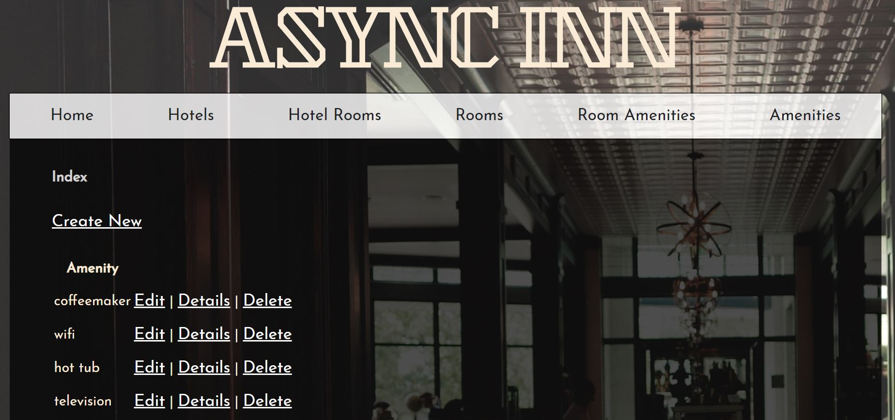
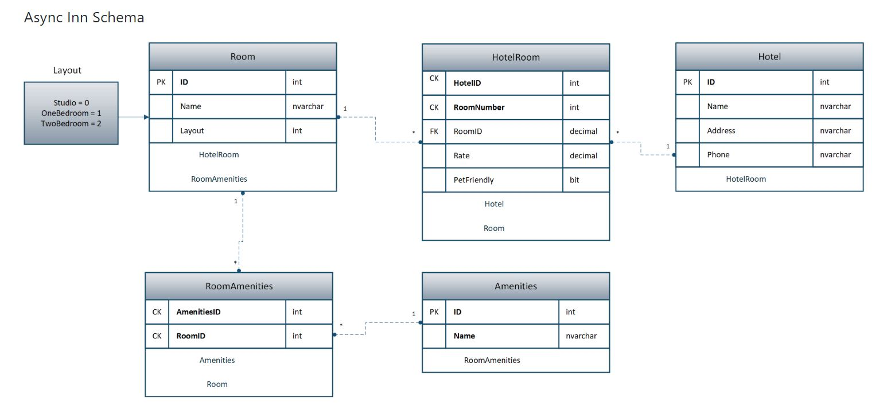

# Lab13-AsyncInn

Create an initial MVC application for a Hotel management system.

## Challenge

* Scaffold out a basic MVC web application. Includes a Home Controller with a basic Index action. Create an MVC web app with a database.
* Using a database schema, convert each entity into a model within the newly created MVC web application. Create a new DbContext named AsyncInnDbContext. Within this DbContext, declare Database tables and set the composite keys.
*  For our website, we will have the following pages:
Home Page to greet the Hotel Admin. This page will also serve as a dashboard for the other locations of the site.
Hotels page that will allow the admin to create and edit new or existing hotels
Rooms page where the admin will be able to create or edit new or existing rooms
Amenities page that will allow the admin to add to their list of existing amenities
A page where they can link the Amenities to the rooms that currently exist
A page where they can add existing rooms to hotels
Following the design, Create a controller for each of the pages listed above.
* Add some html and styling.
* Add data annotations to existing models to validate basic user input fields as appropriate.
* Seed your Hotel, Room type, and Amenities databases 

## Solution

Deployed website URL: https://lab13asyncinn.azurewebsites.net 

## Sample Views of Web App

#### Landing Page

#### Hotels Page

#### HotelRooms Page

#### Rooms Page

#### Amenities Page

#### Async Inn Schema

